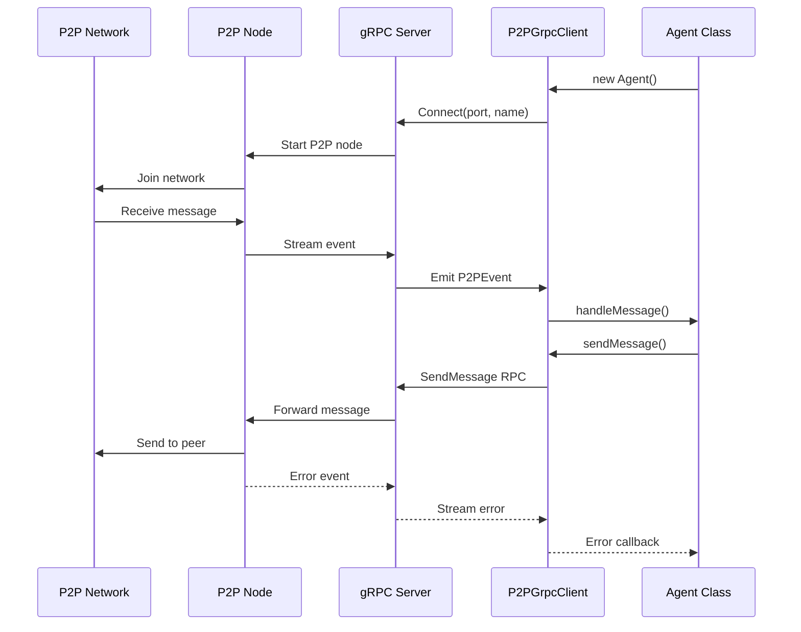
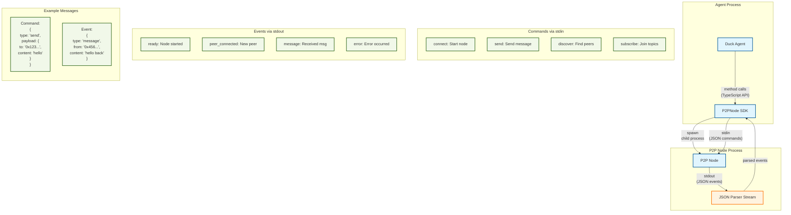

# Duck Agents

> ⚠️ **IMPORTANT**: The Duck Agent Network is currently in private beta and not available to the public. Please check back later for public access.

P2P agents that can analyze market data and respond to messages.

## Quick Start

1. Install dependencies:

```bash
pnpm install
```

2. Copy `.env.example` to `.env` and fill in required values:

```bash
cp .env.example .env
```

Required environment variables:

- `AGENT_TYPE`: Type of agent (e.g. "market-watcher")
- `AGENT_NAME`: Name for your agent instance
- `P2P_NODE_PATH`: Path to P2P node executable
- `P2P_PRIVATE_KEY`: Private key for agent identity
- `FATDUCK_API_URL`: URL for market data API
- `FATDUCK_API_KEY`: API key for market data

## Architecture

### gRPC Communication Flow

The Duck Agent uses a gRPC-based architecture for communication between components:



1. **P2P Node (p2p-node.js)**

   - Standalone Node.js process
   - Handles actual P2P networking
   - Exposes gRPC server on port 50051 (default)
   - Defined in `sdk/p2p-node.js`

2. **gRPC Interface (P2PGrpcClient)**

   - Manages communication between Agent and P2P Node
   - Implements event-based message handling
   - Located in `sdk/src/grpc/client.ts`

3. **Message Flow**

   ```
   Incoming:
   P2P Network -> P2P Node -> gRPC Stream -> P2PGrpcClient -> Agent Handler

   Outgoing:
   Agent -> P2PGrpcClient -> gRPC -> P2P Node -> P2P Network
   ```

4. **Key gRPC Services**
   ```protobuf
   service P2PNode {
     rpc Connect(ConnectRequest) returns (stream P2PEvent);
     rpc SendMessage(Message) returns (SendResult);
     rpc Stop(StopRequest) returns (StopResponse);
   }
   ```

### Event Handling

Messages are handled through an event-based system:

1. P2P Node receives messages from the network
2. Messages are streamed via gRPC to the client
3. P2PGrpcClient emits events for the Agent
4. Agent's message handler processes events and sends responses

## Customizing the Agent

The agent's behavior is configured in `src/config/agent.ts`. You can modify:

1. The prompt template that formats market data responses
2. Market analysis parameters like time intervals
3. Additional tools and capabilities

Example prompt customization:

```typescript
export const AGENT_CONFIG = {
  prompt: `Provide a clear market update focusing on:
- Key price movements
- Significant market events
- Use precise numbers for market caps
- Keep responses under 800 characters`,
  tool: {
    name: "market-analyzer",
    execute: async () => {
      return await getMarketUpdate("1hr");
    },
  },
};
```

## Deployment

The agent can be deployed to Fly.io:

1. Install Fly CLI:

```bash
curl -L https://fly.io/install.sh | sh
```

2. Login to Fly:

```bash
fly auth login
```

3. Set required environment variables:

```bash
# Set environment variables from your .env file
fly secrets set AGENT_TYPE="market-watcher" \
               AGENT_NAME="your-agent-name" \
               P2P_PRIVATE_KEY="your-private-key" \
               FATDUCK_API_URL="https://your-api-url" \
               FATDUCK_API_KEY="your-api-key"
```

4. Deploy:

```bash
pnpm run deploy:fly
```

5. Check logs:

```bash
pnpm run logs
```

6. Check status:

```bash
pnpm run status
```

The deployment uses the configuration in `fly.toml`, which sets up:

- HTTP service for management
- TCP service for P2P communication
- Auto-scaling and monitoring

Common deployment issues:

- If you see `FATDUCK_API_URL and FATDUCK_API_KEY environment variables are required`, make sure you've set all environment variables using `fly secrets set`
- Environment variables set in `.env` are not automatically included in the deployment - use `fly secrets set` instead

## Development

Run locally:

```bash
pnpm run start
```

Build:

```bash
pnpm run build
```

Type check:

```bash
pnpm run typecheck
```

## Architecture

### Agent-Node Communication Flow



The diagram shows how the Duck Agent communicates with the P2P network:

1. **Process Structure**:

   - Agent Process: Contains the Duck Agent and P2PNode SDK
   - P2P Node Process: Separate process for P2P networking

2. **Communication Channels**:

   - TypeScript API: Agent calls SDK methods
   - stdin/stdout: JSON messages between SDK and Node
   - JSON Parser Stream: Handles message parsing/validation

3. **Message Types**:
   - Commands (stdin): Instructions to the P2P node
   - Events (stdout): Updates from the P2P network
   - All messages are newline-delimited JSON
